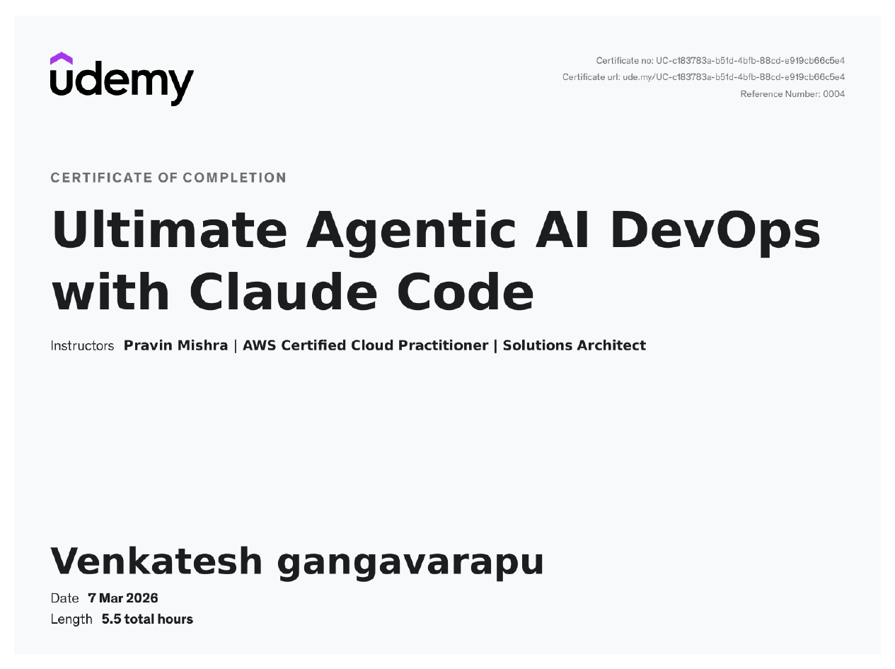

# 🤖 Agentic AI DevOps with Claude Code
### A fully working Agentic DevOps pipeline — built, deployed, and secured using Claude Code

<div align="center">


 **[💼 LinkedIn](https://linkedin.com/in/venkatesh-gangavarapu)** · **[📧 Contact Me](mailto:gangavarapuvenkatesh3@gmail.com)**

</div>

---

## 👋 About This Project

This repository documents my completion of the **Ultimate Agentic AI DevOps with Claude Code** course — a 7-week hands-on program where every week had a real deliverable, not just theory.

**What makes this different from a typical DevOps project:**
- Infrastructure was scaffolded, planned, applied, and deployed using **AI Skills** — not manual commands
- Claude Code was connected to **live Terraform and AWS tools via MCP** — no training data guessing
- A **3-layer safety system** (SAY / DO / LOG hooks) guards every agent action
- The entire pipeline runs from a single Claude Code session

> *"I used to think about AI as a tool I talk to. Now I think about it as a participant I design workflows around."*

---

## 🏗️ Architecture Overview

```
┌─────────────────────────────────────────────────────────────────┐
│                     AGENTIC DEVOPS PIPELINE                     │
├─────────────────────────────────────────────────────────────────┤
│                                                                  │
│   You ──► Claude Code ──► Skills ──► AWS Infrastructure         │
│                │                                                 │
│                ├── CLAUDE.md  (project context, always-on)      │
│                ├── Skills     (task-specific instructions)       │
│                ├── MCP        (live Terraform + AWS tools)       │
│                └── Hooks      (SAY / DO / LOG safety layer)      │
│                                                                  │
└─────────────────────────────────────────────────────────────────┘
```

### Full Deployment Pipeline

```
/scaffold-terraform
        │
        ▼
  terraform init  ◄── (manual, one-time)
        │
        ▼
   /tf-plan ──── validates + summarises changes ──► You review
        │
        ▼ (approved)
   /tf-apply ─── creates AWS resources ──────────► S3 + CloudFront
        │
        ▼
   /deploy ────── syncs site files + CDN invalidation ──► 🌐 Live
```

### AWS Infrastructure

```
                    ┌──────────────────┐
   User Request ───►│   CloudFront CDN │
                    │  (HTTPS + Cache) │
                    └────────┬─────────┘
                             │
                             ▼
                    ┌──────────────────┐
                    │    S3 Bucket     │
                    │  (Static Files)  │
                    │  AES256 Encrypted│
                    └──────────────────┘
```

### MCP Architecture

```
Claude Code Session
        │
        ├──► Terraform MCP Server ──► terraform validate / plan / state
        │
        └──► AWS MCP Server       ──► S3 / CloudFront / IAM live queries
```

### Hook Safety System

```
You type prompt
        │
        ▼
┌───────────────────┐
│  UserPromptSubmit │  ◄── user-prompt-guard.sh
│  (SAY hook)       │      Blocks: "delete all", "rm -rf",
│                   │      "terraform destroy" in prompts
└────────┬──────────┘
         │ prompt clean ✓
         ▼
  Claude plans action
         │
         ▼
┌───────────────────┐
│   PreToolUse      │  ◄── pre-tool-guard.sh
│   (DO hook)       │      Blocks dangerous Bash commands
│   matcher: Bash   │      before execution
└────────┬──────────┘
         │ command safe ✓
         ▼
  Command executes
         │
         ▼
┌───────────────────┐
│   PostToolUse     │  ◄── post-tool-logger.sh
│   (LOG hook)      │      Writes timestamped entry to
│   matcher: Bash   │      .claude/deploy.log
└───────────────────┘
```

---

## 📦 Repository Structure

```
.
├── README.md                          # This file — project showcase
├── CLAUDE.md                          # Project context file for Claude Code
├── .mcp.json                          # MCP server configuration
│
├── .claude/
│   ├── settings.json                  # Hook wiring configuration
│   ├── settings.local.json.example    # Credentials template (safe to commit)
│   ├── skills/
│   │   ├── scaffold-terraform/
│   │   │   ├── SKILL.md               # Terraform scaffolding skill
│   │   │   └── template-spec.md       # Architecture template
│   │   ├── tf-plan/
│   │   │   └── SKILL.md               # Safe Terraform plan skill
│   │   ├── tf-apply/
│   │   │   └── SKILL.md               # Terraform apply skill
│   │   └── deploy/
│   │       └── SKILL.md               # S3 + CloudFront deploy skill
│   └── hooks/
│       ├── user-prompt-guard.sh       # SAY hook — prompt safety
│       ├── pre-tool-guard.sh          # DO hook  — command safety
│       └── post-tool-logger.sh        # LOG hook — audit trail
│
├── terraform/
│   ├── main.tf                        # AWS resources (S3, CloudFront, IAM)
│   ├── variables.tf                   # Input variables
│   ├── outputs.tf                     # Output values
│   └── provider.tf                    # AWS provider config
│
├── site/
│   ├── index.html                     # Portfolio homepage
│   └── css/
│       └── style.css                  # Mobile-first stylesheet
│
└── docs/
    ├── SETUP.md                       # Environment setup guide
    ├── PIPELINE.md                    # How the pipeline works
    └── SAFETY.md                      # Hook system documentation
```

---

## 🛠️ Tech Stack

| Layer | Technology | Purpose |
|---|---|---|
| **AI Agent** | Claude Code | Agentic task execution |
| **Context** | CLAUDE.md | Always-on project awareness |
| **Skills** | Markdown + YAML | Reusable task instructions |
| **Live Tools** | MCP (Terraform + AWS) | Real infrastructure access |
| **Safety** | Bash Hook Scripts | SAY / DO / LOG protection |
| **IaC** | Terraform | AWS resource provisioning |
| **Hosting** | AWS S3 + CloudFront | Static site delivery |
| **Security** | AES256 SSE | S3 encryption |
| **Version Control** | Git + GitHub | Source control |
| **Editor** | VS Code | Development environment |

---

## 🚀 What I Built — Week by Week

### Week 1–2 · Environment + CLAUDE.md
- Verified full DevOps toolchain: AWS CLI, Terraform, Docker, uvx, GitHub, VS Code
- Created `CLAUDE.md` to give Claude project context, architecture, and hard conventions
- Tested that Claude respects the conventions (refused to add React to a no-JS project)

### Week 3 · Skills
- Designed 4 production-grade Skills with correct tool permissions
- `/scaffold-terraform` — Write access (creates files)
- `/tf-plan` — Read-only (never modifies, never applies)
- `/tf-apply` — Execute access (makes live AWS changes)
- `/deploy` — AWS CLI execute (S3 sync + CloudFront invalidation)

### Week 4–5 · First Agentic Deployment
- Ran the full pipeline: scaffold → init → plan → apply → deploy
- Live static site deployed to AWS S3 + CloudFront
- Zero manual Terraform written — scaffolded, planned, and applied via Skills

### Week 6 · MCP Integration
- Connected Terraform MCP server and AWS MCP server via `.mcp.json`
- Ran security audit → Claude found missing S3 encryption
- Fixed with: `"Add S3 server-side encryption using AES256"`
- Re-audited — finding resolved, clean report

### Week 7 · Hooks & Safety
- Implemented 3-layer hook safety system
- **SAY hook** — blocks destructive prompts before Claude reads them
- **DO hook** — blocks dangerous Bash commands before execution
- **LOG hook** — writes every command to `.claude/deploy.log`
- Live demo: `"delete all resources"` blocked, `terraform destroy` blocked, `/tf-apply` logged ✅

---

## ⚡ Quick Start

### Prerequisites
```bash
# Verify your environment
aws --version          # AWS CLI
terraform -v           # Terraform
docker -v              # Docker Desktop
uvx --version          # uvx via uv
git --version          # Git
code --version         # VS Code
```

### Setup
```bash
# 1. Clone this repo
git clone https://github.com/venkatesh-gangavarapu/agentic-ai-devops-claude-code.git
cd agentic-devops-claude-code

# 2. Copy credentials template
cp .claude/settings.local.json.example .claude/settings.local.json
# Edit settings.local.json with your AWS profile name

# 3. Make hooks executable
chmod +x .claude/hooks/*.sh

# 4. Launch Claude Code
claude
```

### Run the Pipeline
```bash
# Inside Claude Code session:
/scaffold-terraform    # Generate Terraform files

# In your terminal:
terraform init         # Initialise providers (one-time)

# Back in Claude Code:
/tf-plan               # Validate + review changes
/tf-apply              # Create AWS resources
/deploy                # Go live 🚀
```

---

## 🔐 Safety System

This project includes a production-ready hook system that protects against accidental destructive operations.

| Hook | Event | Protects Against |
|---|---|---|
| `user-prompt-guard.sh` | UserPromptSubmit | Destructive prompt keywords |
| `pre-tool-guard.sh` | PreToolUse (Bash) | Dangerous shell commands |
| `post-tool-logger.sh` | PostToolUse (Bash) | Creates audit trail |

**Blocked commands include:** `terraform destroy`, `rm -rf`, `aws s3 rm --recursive`, `kubectl delete --all`, `DROP TABLE`

**Audit log location:** `.claude/deploy.log`

---

## 🎓 Course Completion

<div align="center">

**Ultimate Agentic AI DevOps with Claude Code**
Completed: March 2026
Instructor: Pravin Mishra



</div>

---

## 📬 Connect With Me

I'm actively looking for **DevOps / Cloud Engineering / Platform Engineering** opportunities where I can bring Agentic AI thinking into real infrastructure teams.

<div align="center">

[](https://linkedin.com/in/venkatesh-gangavarapu)
[](mailto:gangavarapuvenkatesh3@gmail.com)

</div>

---

<div align="center">
<sub>Built with Claude Code · Deployed on AWS · Secured with Hooks</sub>
</div>
